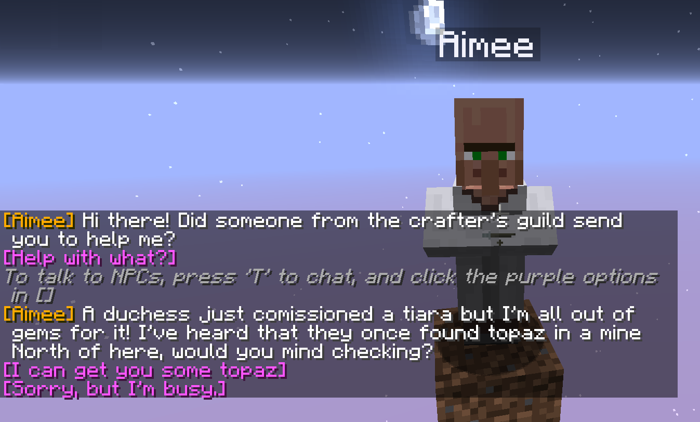
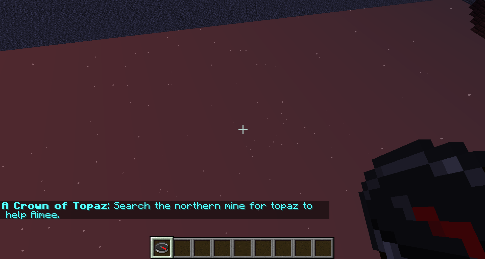

# Scripted Quests
JSON-driven Minecraft Spigot plugin for creating quests

# Table of Contents

- [Description](#description)
- [Sample](#sample)
- [Download](#download)
- [Getting Started / Tutorial](#get-started)
- [Creating Quests with the Online Editor](#web-editor)
- [Structure of a Quests File](#structure)
- [List of Commands / Permissions](#commands)
- [Current Capabilities](#capabilities)

## Description
This plugin was developed for use with Monumenta, a Minecraft
Complete-The-Monument Massively-Multiplayer-Online (CTM MMO) server.

It was developed to allow people who aren't expert command-block builders to
make quests involving interaction with NPCs (mostly villagers). You can
left-click on a villager (or other entity) to talk to them (cancelling the
damage and displaying dialog, if any).

This plugin has two components - the quest interaction system, and a quest
compass which helps players navigate to the locations that the NPC's send them to.

## Sample
Here is an example of interacting with a villager named Aimee:

Quests are made up of two-way dialog - the NPC can "talk" to the player, and
the player can reply by clicking one of the available options in chat. At each
stage in the process arbitrary actions can occur, such as setting scoreboard
values, running commands/functions, sending more dialog, etc.

The quest compass is just a simple mapping between scoreboard values and
locations. For example, if you have score Quest01 = 1, left clicking with an
ordinary compass will make it point to some coordinates. For example:

## Download
Grab one of the plugin jar files from the [release](release) folder. Naming scheme:

`ScriptedQuests_<Target.Minecraft.Version>_<Plugin.Version>-<CompileDate>-<CompileTime>`

Or compile it yourself using the included Ant build script.

## Getting Started / Tutorial
This plugin only currently has compiled versions for Spigot 1.12.2. It will probably work with older versions but you must compile it yourself.

- Install it like all spigot plugins by placing it in your plugins folder.
- Start your spigot server. This should create some folders under
  `plugins/ScriptedQuests/`
- Summon a test villager: `/summon minecraft:villager ~ ~ ~ {CustomName:"Aimee"}`
- Create the needed scoreboard: `/scoreboard objectives add Quest01 dummy`
- Install the quest & compass config files:
	- `samples/sample-quest.json` -> `plugins/ScriptedQuests/npc/sample-quest.json`
	- `samples/sample-compass.json` -> `plugins/ScriptedQuests/compass/sample-compass.json`
- Reload the quest configuration: `/reloadquests`
- Left-click Aimee to talk to her and start the quest.
- Give yourself a compass and right-click it to cycle available quests
- Give yourself the quest item: `/give @s minecraft:dye 1 11 {display:{Lore:["QuestItem"]}}`
- Talk to Aimee again to complete the quest

## Creating Quests with the Online Editor
Creating these by hand is a pain - use the web editor! The web editor not only
helps you structure things correctly but is also the primary documentation for
the various quest options

- Quest Editor - https://rawgit.com/TeamEpic/Scripted-Quests/master/tools/quest_editor.html
- Compass Editor - https://rawgit.com/TeamEpic/Scripted-Quests/master/tools/quest_compass_editor.html

## Structure of a Quests File:
Each quest file has the following info:
- What NPC this quest is for (name, entity type)
- A list of quest components

Quest components contain optional pre-requisites and actions. If the
pre-requisites are met, the actions are run. Every time a player interacts with
an NPC, quest components are run in-order (more than one may be executed).

## List of Commands / Permissions
`/interactNpc <npcName> [EntityType]`
- permission: `scriptedquests.interactnpc`
- EntityType is optional (default = VILLAGER) and can be chosen from this
  list: https://hub.spigotmc.org/javadocs/spigot/org/bukkit/entity/EntityType.html
- This command can be used to build location-based quests that don't
  involve clicking on an NPC. To do this, use a repeating command block.
  with a command of this form: `execute @p[r=5] ~ ~ ~ interactnpc Aimee VILLAGER`
- You will need to structure your QuestComponent so that the pre-requisites
  are only met once if the player will stay in that location for more than
  one invokation of interactnpc.
- Note that running this command every tick is likely unnecessary for most
  use cases - instead, attach it the command to a slow clock instead.

`/questTrigger`
- permission: `scriptedquests.questtrigger`
- **Players that interact with clickable text need to have this permission node.**
- This command is executed by players when they click on chat options.
- This command was designed for security. Players will not be able to use it to
  trigger dialog options except those presented by the NPC they are currently
  interacting with. They also will not be able to click on the same message
  twice.

`/reloadQuests`
- permission: `scriptedquests.reloadquests`
- Reloads Quest NPCs and Quest Compass.
- Provides helpful debugging to resolve problems with any files that fail to load.
- Hover over the error messages in chat for more information.

## Current Capabilities:
prerequisites:
- check\_scores - Checks one or more scoreboard values for the player
- check\_tags - Checks if the player has (or must not have) specific scoreboard tags
- items\_in\_inventory - Checks that the player is carrying the specified items
- location - Checks that the player is within an area

actions:
- dialog - Interaction with an NPC
	- text - Text spoken by the NPC
	- raw\_text - Text directly sent to the player
	- clickable\_text - Text that when clicked runs actions
- set\_scores - Sets scoreboard values for the player
- function - Runs a function using the console "as" the player (@s = player)
- command - Runs a command using the console
- rerun-components - Re-runs all components for this NPC from the beginning

